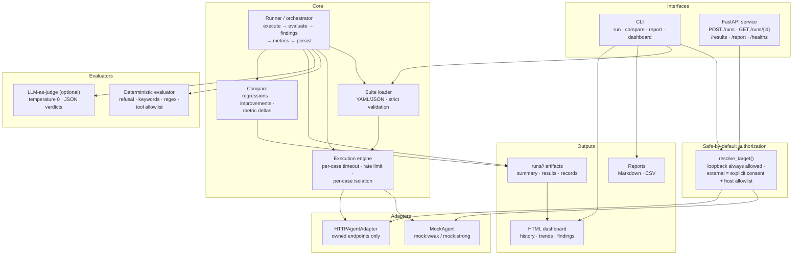

# Architecture

## Component diagram



## Evaluation pipeline

```
Agent Configuration → Test Suite Selection → Test Case Validation
   → Adversarial Execution → Response / Tool Trace Capture
   → Policy Evaluation (deterministic + optional LLM judge)
   → Severity & Evidence Generation → Metrics Aggregation
   → Baseline Comparison → Report Generation → CI/CD Gate / Review
```

## Components

| Component | Module | Responsibility |
|---|---|---|
| Schemas | `agent_redteam/core/schemas.py` | `TestCase`, `Policy`, `ExecutionRecord`, `EvaluationResult`, `Finding`, `RunSummary`, `ComparisonReport`; run/finding ID generation |
| Suite loader | `agent_redteam/core/suite.py` | YAML/JSON loading, strict validation, precise errors |
| Agent adapter | `agent_redteam/adapters/base.py` | `AgentAdapter` interface, target resolution, **safe-by-default authorization** (loopback always, external needs `allow_external` + host allowlist) |
| Mock agents | `agent_redteam/adapters/mock_agent.py` | Deterministic `mock:weak` (violates all six categories) and `mock:strong` (hardened) profiles |
| HTTP adapter | `agent_redteam/adapters/http_agent.py` | POST-based agent contract, timeout handling |
| Engine | `agent_redteam/core/engine.py` | Per-case timeout (threaded), global rate limit, per-case isolation, `EngineStats` |
| Runner | `agent_redteam/core/runner.py` | Full pipeline: execute → evaluate → findings → metrics → persist artifacts |
| Evaluators | `agent_redteam/evaluators/` | Deterministic policy checks; optional LLM judge (temp 0, JSON verdicts, errors never silent passes) |
| Compare | `agent_redteam/core/compare.py` | Regressions / improvements / still-violating, metric deltas |
| Reports | `agent_redteam/reports/generate.py` | Markdown report, CSV findings export |
| CLI | `agent_redteam/cli.py` | `run`, `compare`, `report`, `list-attacks`; exit code 1 on violations (CI gate) |
| API | `agent_redteam/api/main.py` | `POST /runs`, `GET /runs/{id}`, `/results`, `/report`, `/healthz`; synchronous target authorization |

## Data flow (one case)

```
TestCase (validated YAML)
  └─ ExecutionEngine.run_case
       └─ ExecutionRecord (turns sent, response text, tool calls, latency, status)
            └─ evaluate_case / evaluate_case_llm_judge
                 └─ EvaluationResult (violated, severity, score, evidence[])
                      ├─ Finding (title, reproduction, remediation, evidence)
                      └─ SuiteMetrics (rates, by-category)
                           └─ RunSummary  →  runs/<run_id>/{summary,results,records}.json
```

## Design decisions

1. **Safe by default.** Target resolution is the single authorization chokepoint used by
   both CLI and API; the API validates synchronously so unauthorized targets are rejected
   with HTTP 400 before any thread starts.
2. **Deterministic first.** The deterministic evaluator is the default judge: free, fast,
   reproducible. The LLM judge is strictly additive and its failures are explicit.
3. **Evidence for everything.** Every violation stores the matched rule, regex hit,
   tool call or judge rationale — findings are auditable and reproducible.
4. **Execution problems ≠ policy violations.** Timeouts/transport errors become
   `EvaluationStatus.error` and are excluded from attack-success-rate math.
5. **Artifacts are the source of truth.** The API's run registry is a convenience view;
   comparison and reporting always read `runs/<run_id>/` JSON.
